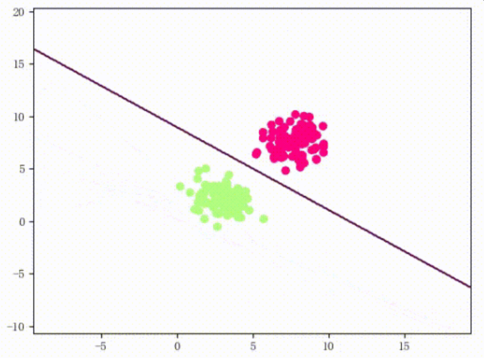
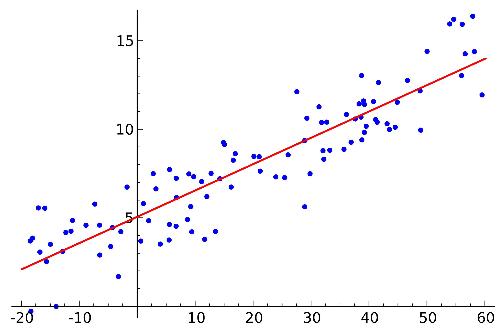
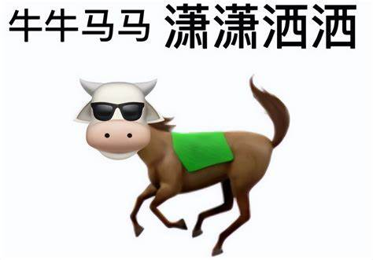

<!--v-->

## “机器学习”和“人工智能”有什么区别？

- 事实上，这两个名词也经常被混用 <!-- .element: class="fragment" -->
- 很多时候它们会指代相同的意思 <!-- .element: class="fragment" -->
- 不过，如果有人跟你强调TA在讲“机器学习”（比如名叫“机器学习”）的课程，那总体上重点会放在传统机器学习上 <!-- .element: class="fragment" -->

---
marp: true
---

# 人类是有极限的！——机器学习的诞生

---

## 回到回到魔法盒子

- 第一个魔法盒子里有一部分输入数据、对应的输出数据 <!-- .element: class="fragment" -->
- 这个魔法盒子根据它们输出模型 <!-- .element: class="fragment" -->
- 第二个魔法盒子根据模型和另一部分输入数据（也就是测试集，test set）输出结果 <!-- .element: class="fragment" -->

--- 

## 魔法？

你可能在各路营销号或有技术的~~营销号~~公众号等自媒体见到过一些AI笑话

- “AI就是魔法”
- “随便动了一个超参数模型就跑起来了”
- ~~我的空间~~

## 魔法！

然而，在机器学习的数据量还未飞升的年代，理论计算机科学家与数学家曾经也有过理论化的机器学习的美好愿望

- 机器学习理论（machine learning theory）最先研究的对象也是比较传统的机器学习算法
- 我们的第二章也将从这里开始

---

## 早期机器学习的典型——感知机（perceptron）

* 开始的开始，机器学习并不是一个“黑盒子”

* 数学家和理论计算机科学家们曾试图以非常理论的方式对机器学习进行研究。
**感知机（perceptron）** 作为机器学习的起源算法之一就是其中的典型。

---

## 早期机器学习的典型——感知机（perceptron）

* 感知机是由美国学者FrankRosenblatt在1957年提出，是一个**二分类的线性分类模型**，其输入为实例的特征向量，输出为实例的类别

* 回想起我们高中生物学过的知识（相信大家已经忘光了）

> 神经细胞结构大致可分为：树突、突触、细胞体及轴突。单个神经细胞可被视为一种只有**两种状态的机器**——激动时为‘是’，而未激动时为‘否’。神经细胞的状态取决于从其它的神经细胞收到的输入信号量，及突触的强度（抑制或加强）。当信号量总和超过了某个阈值时，细胞体就会激动，产生电脉冲。电脉冲沿着轴突并通过突触传递到其它神经元。

   

---

## 早期机器学习的典型——感知机（perceptron）

* 没错，感知机是生物神经细胞的简单抽象，和神经细胞一样，感知机接受多个输入，最终只有一个输出（一般是0或者1）

下图就是一个接收两个输入信号的感知机的例子

  
 

 

* x1 、 x2 是输入信号，y是输出信号， w1、 w2是权重(weight)。

* 图中的○称为“神经元”或者“节点”。输入信号被送往神经元时，会被分别乘以固定的权重（w1 x1 、 w2  x2）。神经元会计算传送过来的信号的总和，只有当这个总和超过了某个界限值时，才会输出1。这也称为“神经元被激活” 。这里将这个界限值称为阈值，用符号``θ``表示。

---

## 早期机器学习的典型——感知机（perceptron）

  
 

 

* 把上述内容用数学式来表示，就是下面这个式子

$$ y = \left\{\begin{matrix} 
  0  \left ( w_1 x_1 +w_2x_2 \le \theta \right ) \\  
  1  \left ( w_1 x_1 +w_2x_2 > \theta \right )
\end{matrix}\right. $$

* 感知机的多个输入信号都有各自固有的权重，这些权重发挥着控制各个信号的重要性的作用。也就是说，权重越大，对应该权重的信号的重要性就越高

---

## 早期机器学习的典型——感知机（perceptron）

* 现在我们取权重参数$(\theta, w1, w2) = (−0.5, 1.0, 1.0)$，并将其可视化

$$ y = \left\{\begin{matrix} 
  0  \left ( -0.5 + x_1 + x_2 \le 0 \right ) \\  
  1  \left ( -0.5 + x_1 + x_2 > 0 \right )
\end{matrix}\right. $$

  
 

 

* 感知机会生成由直线$−0.5 + x_1 + x_2 = 0$分割开的两个空间.很容易发现，如果我们将上侧空间的点坐标输入给感知机，那么将输出1，否则输出是0

* 这其实就是一个非常简单的**二分类线性模型**，我们可以通过这个模型将一些点分成两类
---

## 感知机的缺陷

* 感知机的缺陷非常明显，因为它仅仅是一个线性模型

* 相信聪明的你已经想到了，如果是下图的点要分类，一个简单的感知机模型显然是是无法做到的

  
 

 

---

## 感知机的缺陷

* 图中的○和△无法用一条直线分开，但是如果将“直线”这个限制条件去掉，就可以实现了。比如，我们可以像下图那样，作出分开○和△的空间

  
 

 

* 感知机的局限性就在于它只能表示由一条直线分割的空间。上图这样弯曲的曲线无法用感知机表示。另外，由上图这样的曲线（非线性函数）分割而成的空间称为**非线性空间**，由直线（线性函数）分割而成的空间称为**线性空间**

---

## 多层感知机（MLP）

* 未解决非线性空间的问题，科学家们引入了多层感知机（MLP，Multilayer Perceptron），也叫做人工神经网络

  
 

 

* 多层感知机最底层是输入层，中间是隐藏层，最后是输出层

* MLP在隐藏层中引入了**激活函数**来解决输入输出只能是线性的问题，在此不多赘述

---

## 机器学习的发展

* 回顾一下我们高中学的最小二乘法，其目标就是寻找一个函数，使得所有观测点到该函数的距离的平方和最小（拟合程度最高），从而就可以预测任何一个x所对应的y值

 

 

* 类似的，机器学习的本质也是让计算机自己在数据中学习规律，并根据所得到的规律对未来数据进行预测，这种规律我们可以简单地理解为之前感知机里的$w_1,w_2,\theta$等参数
* 那你可能会有疑问：我们如何让计算机自己去学习规律呢？

---

## 机器学习的发展——反向传播

* **我们首先需要知道：学习规律的过程就是一个优化参数的过程**

* 和最小二乘法一样，我们现在有一系列x和它对应的一系列y，这里的y被称为ground_truth（真实的有效值）

* 也许我们可以这样：
  1. 随机初始化参数
  2. 将原有的x输入，得到一系列输出y_pred(即prediction预测)
  3. 计算y_pred和初始y之间的损失(loss)
  4. 根据损失去修改原来的参数，从而降低loss
  5. 重新进行Step 2

* 重复若干次这样的过程（epoch），我们就可以逐渐优化参数，不断降低loss，最终得到一个模型（model）

* 这样不断更新参数的过程就叫做反向传播

---

## 分类与回归，离散与连续

> “机器学习是让计算机像人类一样学习和行动的科学，通过以观察和现实世界互动的形式向他们提供数据和信息，以自主的方式改善他们的学习。”

* 事实上，一切机器学习的任务都可以分成**分类 和 回归(Regression)**

* **分类**就是对数据分进行分类（好吧好像是废话~），预测的结果往往是一系列**离散**的数据

* **回归**是一种数学模型，利用数据统计原理，对大量统计数据进行数学处理，建立一个相关性较好的回归方程（函数/映射），预测的事实上是一个**连续**的结果

---

## 传统的ML算法（仅做了解）

### 聚类算法

* 朴素贝叶斯（Naive Bayes）

* 逻辑回归（Logistic Regression）

* 感知机（Perceptron）

* **K近邻算法（KNN，K-Nearest Neighbors）**

---

## 经典的聚类算法——KNN (K-Nearest Neighbors)

* 顾名思义，就是k个最近的邻居（k近邻）
* KNN的原理就是**当预测一个新样本的类别时，根据它距离最近的 K 个样本点是什么类别来判断该新样本属于哪个类别（多数投票）**

* **距离度量、k值的选择及分类决策规则**是k近邻法的三个基本要素

---

## 经典的聚类算法——KNN (K-Nearest Neighbors)

 

 

* 图中绿色的点就是我们要预测的那个点，假设K=3。那么KNN算法就会找到与它距离最近的三个点（这里用圆圈把它圈起来了），看看哪种类别多一些，比如这个例子中是蓝色三角形多一些，新来的绿色点就归类到蓝三角了

* **距离度量、k值的选择及分类决策规则**是k近邻法的三个基本要素

---

### 回归算法（看看就好）

* 线性(最小二乘)回归（Linear Regression）

* 多项式回归（Polynomial Regression）
* 逐步回归（Stepwise Regression）
* 岭回归（Ridge Regression）
* 套索回归（Lasso Regression）
* 弹性网回归（ElasticNet Regression）Lasso和Ridge回归技术的混合体
* XGBoost回归
* 泊松回归（Poisson Regression）

---

## 机器学习的学习方式

### 监督学习

* 在KNN中我们会发现：初始的点是有颜色的，所有的data本质都是一个点以及其颜色的二元组，也就说不同的x对应不同坐标的点，不同的y对应点的颜色，即
$$ (点的坐标，颜色) $$

* 像这种提供**输入数据**（比如KNN里的点坐标）和其对应的**标签数据（label**，KNN的点的颜色），然后搭建一个模型，模型经过训练后准确的找到输入数据和标签数据之间的**最优映射关系**，从而对新的未标记数据进行预测或分类，我们称作**监督学习(supervised learning)**

---

## 监督学习

* 没听懂？我们再举一个例子
* 假如有一群 草泥马 和 牛马 组成的马群，这时候需要一个机器对马群进行分类，但是这个机器不知道 草泥马 和 牛马 长什么样儿，所以我们首先拿一堆 草泥马 和 牛马 的照片给机器看，告诉机器 草泥马 和 牛马 长什么样儿。机器经过反复的看，形成肌肉记忆，可以对 草泥马 和 牛马 形成自己的定义，然后机器就可以准确的对马群进行分类。

    
    

---

## 无监督学习（unsupervised learning）

* 定义:**训练数据只包含输入样本，没有相应的标签或目标**

* 无监督学习目标不是告诉计算机怎么做（没有label），而是让它自己去学习怎样做事情

* 包装一下：我们只是单纯的将这两种马的照片给机器看，并没有告诉机器哪些是牛马，哪些是草泥马，机器在观察图片后发现马有两类，并能分辨出草原上的马分别属于哪一类

---

## 无监督学习（unsupervised learning）

### 你是否在想，监督学习是因为找到了映射关系才能对图片进行分类的

### 那无监督学习凭啥能把相似的图片认出来？

* 无监督学习会从无标签数据中学习有效的特征或表示，而同一类的图片具有相似的特征

* 特征提取（Feature Extraction）：将任意数据（如文本或图像）转换成机器学习的数学特征

---

## 分类与回归的再分类

* 通过上面的描述，聪明的你肯定已经发现**回归任务本质上就是一种监督学习**，因为回归任务实际上是在是在数据和标签的基础上学习一个最优的函数曲线

* 而分类任务则相对复杂，可以细分为 **分类(classification)** 和 **聚类(clustering)**两种

* 有点懵是吧？正常。请注意前面的分类任务四字中的**分类**只是泛指，后面的分类则是专指**已知数据和其标签来进一步训练模型进行分类任务**

* 换言之，
**分类**是一种**监督学习**，例如告诉机器哪张是牛马哪张是草泥马
而**聚类**是一种**无监督学习**，例如之前提到的KNN算法

* 现在也有很多文章直接把机器学习的任务直接分为**分类**，**聚类**，**回归**三类，是更好的选择

---

## 分类与回归的再分类

    

---

## 认识到优质数据的稀缺性

* 在信息化社会，数据被誉为新的石油然而，与之相反的是，我们却面临着优质数据的严重缺乏。这种现象引发了一系列的问题，特别是在人工智能（AI）和机器学习（ML）领域，这一问题尤为突出。

* 什么是优质数据？

* 优质数据是指具有高度准确性、一致性、完整性和可靠性的数据。这种数据不仅要精确无误，还要对我们要解决的问题有直接的相关性。

* 还有一些领域，比如医疗领域，获取足够的数据本身就是一个挑战。

---

## 半监督学习（Semi-supervised learning）（仅做了解）

* 顾名思义，半监督学习利用**少量有标签的数据和大量无标签**的数据来训练模型

* 在数据稀缺条件下的被迫选择
---

# 机器学习的分类

    

---

    

---

# Summary

* 今天我们介绍了：

* 早期机器学习简单线性模型——感知机

* 机器学习的简单原理

* 机器学习的分类

  * 监督学习
    
    * 分类（classification）：感知机

    * 回归 （regression）：最小二乘法

  * 无监督学习

    * 聚类 （clustering）：KNN算法
