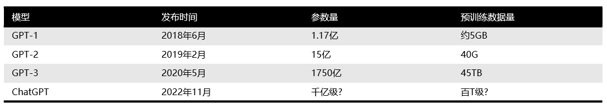
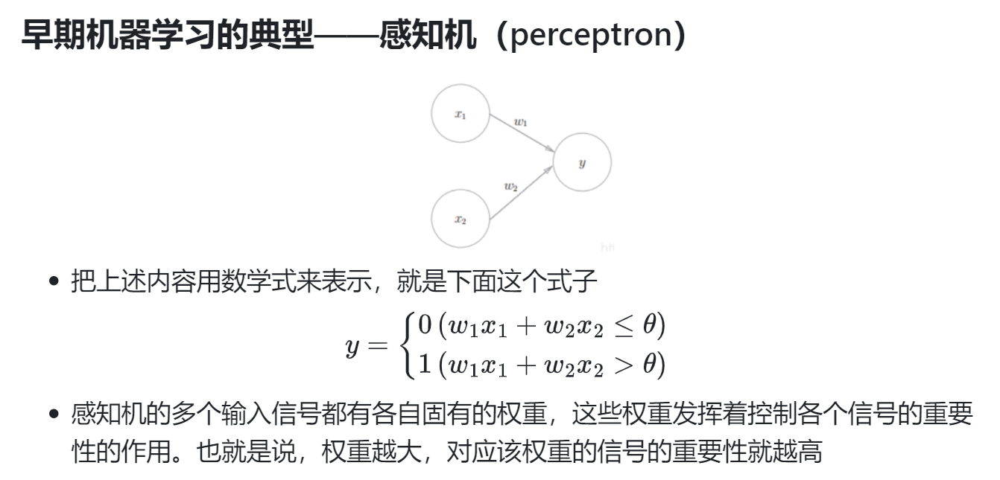

# 力大砖飞的时代——模型的转变

---

## Intro：GPT模型参数爆炸式增长

从2018年起，OpenAI就开始发布**生成式预训练语言模型GPT**（Generative Pre-trained Transformer），可用于生成文章、代码、机器翻译、问答等各类内容。每一代GPT模型的参数量都爆炸式增长，堪称“越大越好”。2019年2月发布的GPT-2参数量为15亿，而2020年5月的GPT-3，参数量达到了1750亿。从下面的参数量可以看出，这是个多么恐怖的模型。

* 最新的GPT-4在120层中总共包含了1.8万亿参数，规模是GPT-3的10倍以上

---

### 为什么LLM发展的趋势是不断提高参数量？

### 或者说，增加参数量是如何让LLM的performance变的更好的？

### 通过这节课的学习，你或许能找到答案

---

## Re：从零开始的ML学习

上节课我们简单介绍了一些ML的基础知识，包括它的分类，任务以及简单原理

回顾上节课回顾过的高中知识，最小二乘法的原理实际上是求一个**损失函数**取得最小值时的函数参数

即 $L = \frac{1}{2n} \sum_{i=1}^{n} (y_i-f(x_i))^2$，求$min(L)$

其中$(x_i,y_i)$就是我们输入的data，n代表data的数量

这对于学过了三年高中数学的你可能非常简单：只需要求导就好了

    

---

## 回归问题一定有解析解吗？

当然不是，甚至大部分回归问题都没有准确的解析解

例：（2017年全国II卷）21.$f(x) = x^2 -x -x Inx$
证明：$f(x)$存在唯一的极大值$x_0$，且$e^{-2}<f(x_0)<2^{-2}$

* 经常做导数题的大家想必都知道，这是一道经典的隐零点问题

* 求个导，$f'(x) = 2x - 2 -Inx$，这里的$x_0$显然是无法直接求出的

---

## 梯度下降法

* 事实上，我们从始至终的目标没有变过：**使损失函数（Loss function）达到最小值**

* 只是因为并不是所有回归问题都有解析解，因此我们不能直接求出损失函数的最小值，只能退而求其次，求出求**近似解**，于是诞生了梯度下降法

* 梯度下降法是一种**优化方法**，是一种通过求目标函数的导数来寻找目标函数最小值的方法，**最终求得的是逼近数值解**

---

## 什么是梯度下降法？

* **梯度就是导数**

* 沿着梯度方向就是函数变化最快的方向

* 假设一个这样的场景，一个人被困在山上，需要从山上下来(找到山的最低点，也就是山谷)，但此时山上的浓雾很大，导致可视度很低。因此，下山的路径就无法确定，他必须利用自己周围的信息去找到下山的路径。

* 如果采用梯度下降算法，就是**以他当前的所处的位置为基准，寻找这个位置最陡峭的地方，然后朝着山的高度下降的方向走**，然后每走一段距离，都反复采用同一个方法，最后就能成功的抵达山谷

    

---

## 梯度下降法

    

按照梯度下降法：

1. 明确自己现在所处的位置

2. 找到相对于该位置而言下降最快的方向

3. 沿着第二步找到的方向走一小步，到达一个新的位置，此时的位置肯定比原来低

4. 回到第一步

5. 终止于最低点

---

## 数学上的解释

    

定义如上图的公式，J是关于Θ的一个函数，我们在山林里当前所处的位置为$Θ^0$点，要从这个点走到J的最小值点，也就是山底。首先我们先确定前进的方向，也就是梯度$\bigtriangledown J(\theta )$的反向，然后走一段距离的步长，也就是α，走完这个段步长，就到达了$Θ^1$这个点。

    

---

## 学习率$\alpha$

    

* α在梯度下降算法中被称作为**学习率**，意味着我们可以通过α来控制每一步走的距离，以保证不要步子跨的太大，其实就是不要走太快，错过了最低点。同时也要保证不要走的太慢，导致太阳下山了，还没有走到山下。

* 所以**α的选择在梯度下降法中往往是很重要的**！α不能太大也不能太小，太小的话，可能导致迟迟走不到最低点，太大的话，会导致错过最低点！

    

---

## 感知机的拓展：从二维到n维

* 在之前的课程中我们介绍了一个非常简单的感知机（perceptron）模型

    

* 这个模型只接受二维$(x_1,x_2)$的输入，思考一下，如果输入是三个，四个，乃至n个（三维，四维到n维）呢？

---

## 深度神经网络的诞生：多层感知机（MLP）

* 刚刚我们在输入层面拓展了感知机模型，使之可以接受若干个输入

* 那我们是否也可以给感知机堆叠层数使之更加复杂呢？

* 为此，我们引入**多层感知机**（Multi-Layer Perception）

---

## 多层感知机简介

* 与感知机不同的是，除了输入输出层，它中间可以有多个隐层（hidden layer），并且有多个输出，如下图：

    

---

## 多层感知机简介

* 隐藏层的神经元怎么得来的？

* 首先它与输入层是全连接的，类似于简单的感知机结构，假设输入层用向量**X**表示，则隐藏层的输出就是 $f (W_1X+b_1)$，$W_1$是权重（也叫连接系数），$b_1$是偏置，
函数 f 可以是**激活函数** (常用的sigmoid函数，tanh函数，RELU函数等)

* 为什么使用激活函数？

    *  不使用激活函数，每一层输出都是上层输入的线性函数，无论神经网络有多少层，输出都是输入的线性组合。

    * 使用激活函数，能够给神经元引入非线性因素，使得神经网络可以任意逼近任何非线性函数，这样神经网络就可以利用到更多的非线性模型中。
    * 通过使用激活函数，MLP解决了感知机只能进行线性分类的问题

---

## MLP的简单训练过程

> 训练的过程就是一个优化参数的过程

* 前向传播：输入层数据开始从前向后，数据逐步传递至输出层

* 反向传播：损失函数开始从后向前，梯度逐步传递至第一层。反向传播用于权重更新，使网络输出更接近标签

* 在反向传播中，会使用**梯度下降法**更新参数以减小损失函数的值

---

# 走向模块化的神经网络

---

## 层和块

* 之前首次介绍神经网络时，我们关注的是具有单一输出的线性模型（感知机）。 在这里，整个模型只有一个输出。  
注意，单个神经网络 （1）接受一些输入； （2）生成相应的输出； （3）具有一组相关参数（parameters），更新这些参数可以优化某目标函数。

* 对于多层感知机而言，我们可以认为整个模型及其组成层都是这种架构

---

## 层和块

* 对于多层感知机而言，我们可以认为整个模型及其组成层都是这种架构

* 整个模型接受原始输入（特征），生成输出（预测）， 并包含一些参数（所有组成层的参数集合）。 同样，每个单独的层接收输入（由前一层提供）， 生成输出（到下一层的输入），并且具有一组可调参数， 这些参数根据从下一层反向传播的信号进行更新。

    

---

## 层和块

* 为了更好的实现更加复杂的网络，我们引入了神经网络块的概念。 

* 块（block）可以描述单个层、由多个层组成的组件或整个模型本身。 使用块进行抽象的一个好处是可以将一些块组合成更大的组件。通过定义代码来按需生成任意复杂度的块， 我们可以通过简洁的代码实现复杂的神经网络。

* 块的概念十分宽泛，MLP的任意一层可以看成一个**块**，整个MLP也能看做一个**块**

    

---

# 深度学习的发展：研究方向的细分和新模型的提出

* 随着深度学习的发展和研究方向的细化，CV（计算机视觉，computer vision）和NLP（自然语言处理，Natuarl Language Processing）成为深度学习发展最迅速、最具前景的两大分支

---

## CV与CNN网络架构

* CNN，即卷积神经网络（Convolutional Neural Networks），是一种专门用于处理具有类似网格结构数据（如图像）的深度学习模型。

* 它利用卷积核（也称为滤波器或kernel）在输入图像上进行滑动窗口操作，来获取“感受野”范围内数据之间的关系特征。一张图片里，相邻的像素显然是有更强的相关性，相比于MLP，CNN突出了这种相邻的关系特征，因而更加准确的获取了图片内的有用信息。

    

---

## NLP与RNN网络架构

* RNN，即循环神经网络（Recurrent Neural Networks），是一种用于处理序列数据（如语言）的深度学习模型。

* 普通的神经网络缺乏记忆能力，因此在处理序列数据时表现不佳。例如，你要预测句子的下一个单词是什么，一般需要用到前面的单词，因为一个句子中前后单词并不是独立的。

* RNN之所以称为循环神经网路，即一个序列当前的输出与前面的输出也有关。具体的表现形式为网络会对前面的信息进行记忆并应用于当前输出的计算中。

    

---

## 现在的神经网络发展：从功能化的堆叠到纯粹的暴力堆层

* 我们可以把一个神经网络视作一个块，将几个已知的拥有不同功能的神经网络堆叠在一起，就可以实现不同的下游任务

* 现在的网络已经回归到了纯粹的堆叠上，不断重复相同的块，在猛堆参数量的条件下，依靠暴力依旧能取得很好的效果（如GPT，LLAMA等架构）

    

