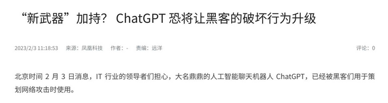
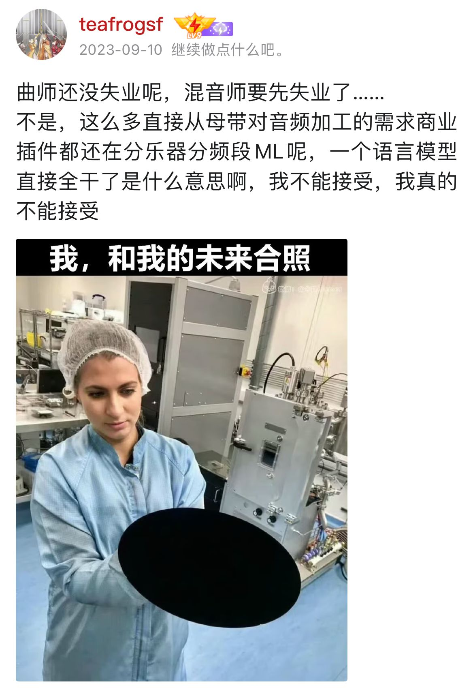

# Intro: ChatGPT 的诞生

<!--v-->

## ChatGPT

- ChatGPT: Chat Generative Pre-trained Transformer
- 2022 年 11 月 30 日，ChatGPT 横空出世，短短5天，注册用户数就超过100万。
- 2023 年一月末，ChatGPT的月活用户已突破1亿，成为史上增长最快的消费者应用。
- 笔者当时拿它做疫情期间的英语试卷，比我分还高 /TwT/
- 引发了一火车 **新闻学乱象**

<!--s-->

# AI 的两大流派 - NLP VS CV

<!--v-->

## 自然语言处理（NLP, Natural Language Processing）

- 顾名思义：关注如何让计算机理解、解释和生成人类语言。
- 特点：
    - 离散（Discrete）： 处理的文本数据是离散的字符和词汇。
    - 长上下文依赖（Long Context Dependency）： 理解和生成文本需要长距离的上下文信息。
    - 线性结构（Linear）： 语言数据可以看作是线性序列，如语句中的单词顺序。
- 主要任务：
    - 语言模型（Language Modeling）： 预测下一个词汇。
    - 机器翻译（Machine Translation）： 将一种自然语言翻译成另一种。
    - 情感分析（Sentiment Analysis）： 分析文本中的情感倾向。
    - 文本生成（Text Generation）： 生成有意义的文本段落。

<!--v-->

## 计算机视觉（CV, Computer Vision）

- 让计算机能够像人类一样理解和解析视觉世界。
- 特点
    - 连续（Continuous）： 处理的图像和视频数据是连续的。
    - 局部性（Locality）： 图像中每个像素的位置和邻域关系非常重要。
- 主要任务
    - 图像分类（Image Classification）： 识别图像所属的类别。
    - 目标检测（Object Detection）： 找出图像中的目标及其位置。
    - 语义分割（Semantic Segmentation）： 将图像划分为具有不同语义的区域。
    - 人脸识别（Face Recognition）： 识别并确认图像或视频中的人脸。

<!--v-->

## 其他流派

- 语音识别: 将口语转换为书面文本
    - 任务: 语音转文本、语音分析、语音生成
    - 应用: 语音助手、自动翻译电话、无障碍沟通技术
- 强化学习: 关注如何通过奖励和惩罚机制指导代理（agent）学习策略。
    - 任务: 策略优化、环境交互、奖励机制设计
    - 应用: 游戏AI、机器人控制、自动化交易系统
- 生成对抗网络（Generative Adversarial Networks, GANs）: 由生成器和判别器组成的模型框架，用于生成接近真实数据的假数据。
    - 任务： 图像生成、图像超分辨率、数据增强。
    - 应用： 图像合成、虚拟现实、艺术创作。

<!--v-->

## CV 与 NLP 的早期发展

- 计算机视觉的发展在深度学习时代率先取得了显著突破，其关键事件是上节课说的 AlexNet。
    - AlexNet 使用 CNN 取得了远超传统方法的准确率，激发了研究热潮。
    - 随后几年，计算机视觉领域涌现出一系列创新，包括VGGNet、GoogLeNet、ResNet等，更深更复杂的网络模型不断刷新图像识别的性能记录。
- 与此同时，自然语言处理（NLP）主要依赖于循环神经网络（RNN）及其变种，如LSTM和GRU，来处理序列数据。
    - 然而，RNN结构在处理长距离依赖和并行计算方面存在固有的局限性。
    - 2017年，Vaswani等人在论文 [**《Attention is All You Need》**](https://arxiv.org/abs/1706.03762) 中提出了Transformer模型，彻底改变了NLP领域。
        - 之前了解过 AI 的同学对这个文章名应该不陌生 ~~Money is All You Need~~
    - Transformer摒弃了RNN结构，采用了自注意力机制（self-attention mechanism），极大地改善了处理长距离依赖和并行计算的能力。

<!--v-->

## NLP 的异军突起

- 基于Transformer的 **语言模型** 如BERT、GPT系列、T5等，迅速成为NLP的主流技术。
- 这些模型大幅提升了各类NLP任务的表现，从文本分类、机器翻译，到问答系统和文本生成。
- 更可怕的是……
- Transformer不止局限于NLP，也开始在**计算机视觉、语音处理等**领域展现出强大的通用性和适用性。

<!--  -->
 <!-- .element: class="fragment" -->

<!--s-->

# 这么厉害？那 NLP 到底在干什么？

<!--v-->

## NLP 的主要任务

- 基础任务:
    - 分词（Tokenization）
    - 词性标注（Part-of-Speech Tagging）
    - 命名实体识别（Named Entity Recognition）
    - 句法解析（Syntactic Parsing）
- 高级任务:
    - 机器翻译（Machine Translation）
    - 文本摘要（Text Summarization）
    - 情感分析（Sentiment Analysis）
    - 问答系统（Question Answering）

<!--v-->

## NLP 的研究

- 模型研究（基础任务研究）：
    - 这类研究主要关注开发新的算法或模型，目标是提升对自然语言理解的基本能力。比如开发新的分词算法、改进词性标注器等。这些研究类似于创造新的“积木块”。
- 下游任务研究：
    - 这部分研究关注如何将已有的模型应用于特定的实际任务，如机器翻译、文本生成等。它们相当于利用基础研究中创造的积木块，来构建复杂的系统或解决具体的问题。

<!--v-->

## NLP 研究的思维方式

- 传统的NLP研究主要依赖于
    - 规则：专家手动编写语言规则，例如语法规则和词典，这些用于进行各种语言处理任务。
    - 统计方法：基于大规模的语言数据，利用统计学原理，构建如隐马尔可夫模型（HMM）等进行语言建模。
- 在引入人工智能之后，自然语言处理领域产生了不同的方法学流派：
    - 符号主义（Symbolism）：关注显式规则和逻辑推理，强调知识的表达和推理，比如基于知识图谱的方法。
    - 连接主义（Connectionism）：即神经网络方法，强调通过大量数据和神经网络模型进行学习，典型代表如深度学习和word2vec。

<!--v-->

## 线性代数基础

- 在理解现代NLP（尤其是神经网络方法）时，线性代数是一个重要的工具。关键概念包括：
    - 向量（Vectors）：用于表示单词、句子等的数值表示。
    - 矩阵（Matrices）：代表操作向量的线性变换。
    - 奇异值分解（SVD）和特征值分解（Eigendecomposition）：用于降维和抽取数据的主要特征。

<!--v-->

## word2vec（连接主义的胜利）

- word2vec是Google提出的一种用于生成词向量（词嵌入）的算法，并且展示了连接主义方法在NLP领域的巨大成功。它的核心想法是：

    - 通过扫描大规模的文本数据，word2vec学习到每个单词的向量表示（embedding），使得语义上相近的词在向量空间中彼此接近。
    - 它利用两个模型框架：Skip-Gram和**Continuous Bag of Words（CBOW）**来高效地学到这些嵌入。

- word2vec的成功标志着数据驱动方法（连接主义）在NLP中的巨大潜力，从而推动了基于神经网络的深度学习方法成为主流。

<!--s-->

# 连接主义

<!--v-->

## 以前的连接主义

- 主要依赖于递归神经网络（RNN）及其扩展
- RNN可以处理任意长度的序列，适用于各种自然语言任务，如句子分类、机器翻译等。
- 局限：
    - 梯度消失和爆炸：随着序列长度的增加，梯度在反向传播过程中可能会逐渐消失（变得非常小）或爆炸（变得非常大），导致训练困难。
    - 长距离依赖问题：RNN在捕捉远距离信息时表现不佳，容易“遗忘”早期重要的信息。
- 如何解决？
    - 长短期记忆（LSTM）：通过引入门控机制（输入门、忘记门和输出门）来控制信息的流动，从而有效缓解梯度消失问题。
    - 门控循环单元（GRU）：是LSTM的简化版，也采用门控机制，但参数更少，使得计算更为高效。
    - **Attention 机制**

<!--v-->

## Attention 机制

- Attention机制是一种用于增强神经网络捕捉全局信息的技术。其核心思想是：在处理序列的每一步时，不仅关注当前输入，还要“关注”序列中其他相关位置的信息，分配不同的权重给这些位置，从而得到一个更为动态和灵活的信息表示。
- 在理解Attention机制时，线性代数起到了重要的作用：
    - 向量和矩阵运算：Attention机制通过计算一系列向量和矩阵的点积、加权求和等操作来实现。
    - Softmax函数：用于将计算出的权重标准化为概率分布。

<!--v-->

## Attention 的诞生

- Attention机制首先在机器翻译任务中得到应用，可以显著提升翻译质量。最早的Attention模型由Bahdanau等人提出（2014），它引入了一个可学习的权重矩阵来在翻译过程中动态分配注意力，从而更好地捕捉源语言和目标语言之间的对齐关系。

<!--v-->

## Attention Is All You Need（Attention机制的成功）

- 在2017年，Vaswani等人提出了Transformer模型，彻底改变了NLP领域。这篇论文题为“Attention Is All You Need”，核心观点是：通过Attention机制完全替代传统的RNN/LSTM结构，可以大幅提升模型的并行计算能力和长距离依赖处理能力。
- Transformer模型的特点
    - 自注意力机制（Self-Attention）：允许在每个时间步通过Attention机制聚合整个序列的信息。
    - 多头注意力（Multi-Head Attention）：通过多个独立的Attention头来捕捉不同的子空间表示，从而获得更丰富的信息。
    - 层归一化和前馈网络：结合线性代数和非线性变换，增强了模型的表达能力与训练稳定性。

<!--v-->

## CV与NLP的相辅相成

- 在计算机视觉（CV）领域，Attention机制也同样得到了广泛应用。例如，Vision Transformer（ViT）便是将Transformer架构从NLP迁移到CV领域的成功案例。这表明，CV和NLP之间可以相互借鉴和影响，促进彼此的发展。例如：
    - Feature Extraction：在图像处理中，Attention可以帮助提取更重要的特征。
    - 结构上的共性：CV中的图像信息与NLP中的文本信息都可以被视为高维序列，通过Attention机制处理这些序列能取得显著效果。
    - 工具和方法的共用：如线性代数、矩阵运算等，对理解和实施Attention机制至关重要，跨越CV和NLP领域。